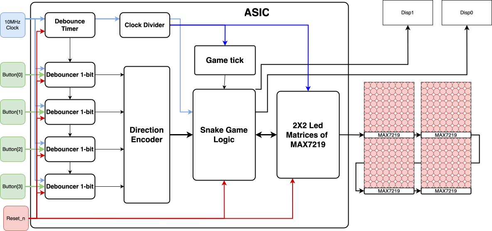
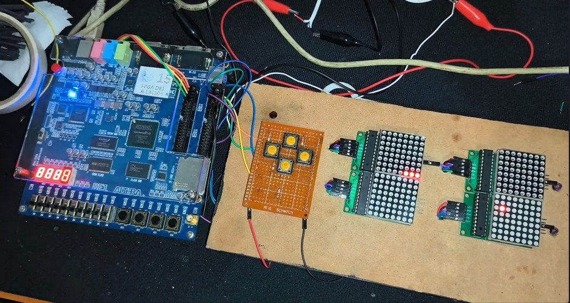
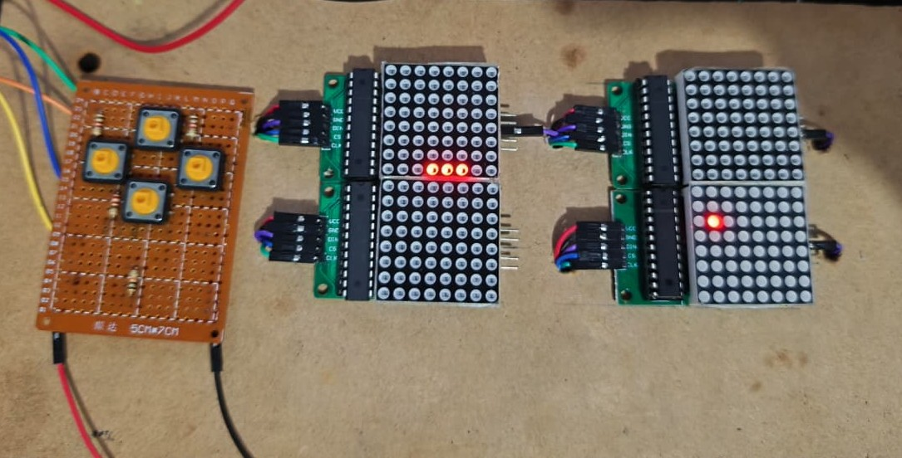

# Minimal Snake Game ASIC 

**Authors:** Valeria Molano and Luisa Fernanda Avendaño.

This is a simple snake game project selected as the best course project from the **Digital Asic Design** 2025-2 course at Universidad Pedagogica y Tecnologica de Colombia - Tunja. The course has been taught by professor [Juan David Guerrero Balaguera](https://github.com/divadnauj-GB).

[Here](https://youtu.be/Ej_GrQa6S1c) you can find a Demo of an FPGA implementation of the Snake Game.

## Architecture details 

This project consist of an minimal ASIC design of the classical Snake videogame using four 8X8 Led Matrices and four input push buttons for controlling the game. The ASIC is all full implemented using verilog. 

### Technical Specification for Snake Game

**Microchip Snake Game (snake_game_uptc)**
- **ASIC Flow:** LibreLane / OpenLane
- **Top Module:** snake_top
- **Project:** Tiny Tapeout
- **License:** Apache-2.0

### 1. General System Description

Below you can see the description and hardware implementation (Verilog RTL) of the Snake game. The design is intended to control 4 coupled 8×8 LED matrices, forming a 16×16 pixel game area. The circuit integrates clean reading of mechanical buttons, the complete game logic through a state machine, snake and food position control, a BCD scoring system, and SPI communication to drive the external displays via the MAX7219 driver.

*Figure 1: Hardware architecture and data flow in snake_top.*

### 2. Internal Module Description

#### 2.1 snake_top (Main Module)

- **Clock Management:** Takes the 10 MHz base clock (CLOCK_10) and generates a 1 MHz signal (slow_clk) exclusively for SPI transmission.
- **Game Speed:** The game_tick signal controls every step of the snake. It starts with a long wait cycle and, every time an apple is eaten, the set_timer signal reduces that wait time by 16,384 cycles. This progressively accelerates the game in 10ms approx.

#### 2.2 Debounce (Debounce Filter)

Cleans the mechanical noise from the buttons. Each button (KEY [3:0]) enters a shift register. The signal only changes its internal logical state if it remains stable (high or low) for 8 consecutive clock cycles.

#### 2.3 Game_core (Game Logic)

- **FSM (11 States):** Controls the entire flow: initializes the screen, updates the snake's coordinates, checks for collisions, and sends commands to draw the matrix row by row.
- **FIFO Memory:** A 32-position circular register that stores the X, Y coordinates of the snake's body. It uses pointers to add the new head and delete the last part of the tail with each movement.
- **LFSR Generator:** Creates pseudo-random numbers based on a linear-feedback shift register. It is used to calculate random coordinates for the appearance of food.
- **BCD Score:** A binary-coded decimal counter. Its outputs go directly to 8 pins (4 for tens, 4 for units), allowing simple LEDs to be connected to display the score in binary without needing additional decoders.

#### 2.4 Spi_driver (Display Controller)

Receives 16-bit parallel commands from the game_core and serializes them. Generates the necessary clock, data, and chip select (CS) pulses to communicate in a standard way with the MAX7219 ICs of the LED matrices.

### 3. Pin Specification (Pinout)

**Table 1: Input and output signals map of the Design.**

| Signal | Type | Width | Origin / Destination | Description |
|---|---|---|---|---|
| CLOCK_10 | Input | 1 bit | System | Base board clock (10 MHz). |
| SW [0] | Input | 1 bit | Switch | Asynchronous reset (Active low 0). |
| KEY [0] | Input | 1 bit | Button | Moves Left. |
| KEY [1] | Input | 1 bit | Button | Moves Right. |
| KEY [2] | Input | 1 bit | Button | Moves Down. |
| KEY [3] | Input | 1 bit | Button | Moves Up. |
| MAX_DIN | Output | 1 bit | SPI Driver | Serial data output to MAX7219. |
| MAX_CLK | Output | 1 bit | SPI Driver | Clock for SPI transmission. |
| MAX_CS | Output | 1 bit | SPI Driver | Chip Select (CS) signal for the matrix. |
| HEX0 [3:0] | Output | 4 bits | Score LEDs | Counter units (for 4 LEDs). |
| HEX1 [3:0] | Output | 4 bits | Score LEDs | Counter tens (for 4 LEDs). |

**Table 2: Input and output pins on the TinyTapeot chip.**
|||||
|-|-|-|-|
|#|Input (ui)|Output (uo) |Bidirectional (uio)|
|0|left     | spi_din   | disp1[0]  |
|1|right    | spi_clk   | disp1[0]  |
|2|down     | spi_cs    | disp1[0]  |
|3|up       | -         | disp1[0]  |
|4| -       | disp0[0]  | -         |
|5| -       | disp0[0]  | -         |
|6| -       | disp0[0]  | -         |
|7| -       | disp0[0]  | -         |

## How it works

See the General System Description and Internal Module Description sections above for the full technical breakdown of `snake_top`, `debounce`, `game_core`, and `spi_driver`.

## How to test

1. Connect the 4-module MAX7219 LED panel and the 4 direction push-buttons (see the **Pin Specification** table above).
2. Release reset (`SW[0]`).
3. Use the direction buttons to guide the snake toward the food. The game ends on collision with a wall or with the snake's own body.

## External hardware

- 4× individual 8×8 MAX7219 LED matrix modules (2×2 grid, `DIN`/`DOUT` daisy-chained, `CLK`/`CS` in parallel).
- 4× momentary push-buttons (active-low) for direction control.

## Notes and Known Behaviors

Supplementary material in the repository:

1. **YouTube Demo Video:** Demonstration of physical operation on FPGA. Link: [https://youtu.be/Ej_GrQa6S1c](https://youtu.be/Ej_GrQa6S1c)
2. **Confirmation Images:** Visual evidence of the states and rendering of the game.

*Figure 2: Implementation on FPGA*

*Figure 3: Working operation evidence*

**Table 2: Operational details to consider for hardware integration.**

| Code | Behavior | Recommended Solution |
|---|---|---|
| **NOTE-01** — KEY Inversion | The direction pins on the main module are logically inverted (e.g., when receiving "Up", "Down" is processed). | Physically cross the button connections on the motherboard during assembly. |
| **NOTE-02** — Self-collision | If the direction opposite to the current movement is pressed (e.g., moving right and pressing left), the game applies the 180° turn before advancing, detecting a collision with its own body. | The player must make "U" turns in two steps (e.g., press "Up" and immediately "Left"). |
